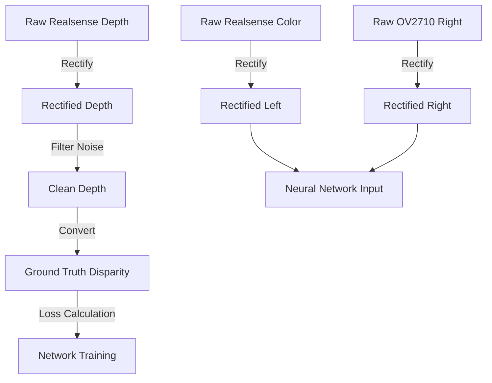

# Stereo Vision Preprocessing Pipeline: A Deep Dive

This document explains exactly how your raw data is transformed into training inputs for the Neural Network.

## 1. The High-Level Pipeline
The goal is to convert **Raw, Unaligned Images** + **Noisy Depth** into **Rectified, Aligned Images** + **Clean Disparity**.



---

## 2. Calibration (The Source of Truth)

Everything relies on the calibration file: [camera_scripts/manual_calibration_refined.npz](file:///home/koener/Documents/Capstone_Bot/capstone_bot/ros2_ws/src/Mono_Duo_Depth/camera_scripts/manual_calibration_refined.npz).
This defines the physical relationship between your two cameras.

**Current Values:**
*   **Left Camera (Realsense)**: Intrinsic Matrix $K_1$, Distortion $D_1=0$.

*   **Right Camera (OV2710)**: Intrinsic Matrix $K_2$, Distortion $D_2 \approx [-0.07, -0.01, ...]$.
*   **Stereo Extrinsics**:
    *   **Rotation ($R$)**: The rotation matrix to align Right camera to Left.
    *   **Translation ($T$)**: The physical distance (Baseline) is approx **13.1 cm**.

## 3. Rectification (The Critical Step)
**Why?** The neural network searches for matching pixels *horizontally*. It assumes that if a pixel is at row 100 in the Left image, it is also at row 100 in the Right image.
**How?** We use `cv2.stereoRectify` in `CustomLoaderRectified.py`.

This function calculates continuous maps (`map1`, `map2`) that warp the images to:
1.  **Undistort** them (straighten curved lines, especially on the OV2710).
2.  **Rotate** them so their optical axes are parallel.
3.  **Align** them so epipolar lines are horizontal scanlines.

**Code Reference:**
[dataset_loaders/custom_loader_rectified.py](file:///home/koener/Documents/Capstone_Bot/capstone_bot/ros2_ws/src/Mono_Duo_Depth/neural_network/dataset_loaders/custom_loader_rectified.py#L110)
```python
# Compute Rectification Maps
R1, R2, P1, P2, Q, ... = cv2.stereoRectify(...)
self.map1_l, self.map2_l = cv2.initUndistortRectifyMap(...)
self.map1_r, self.map2_r = cv2.initUndistortRectifyMap(...)
```

## 4. Depth Cleaning (The "Terrible" Fix)
Your Realsense depth map is dirty. It has:
*   **Holes**: Zeros where the sensor couldn't see anything.
*   **Spikes**: Random noise values.

We apply a strict filter in `CustomLoaderRectified.py`:
```python
# Filter Noise
min_depth = 0.1  # 10 cm
max_depth = 20.0 # 20 meters
mask_valid = (depth_map > min_depth) & (depth_map < max_depth)
depth_map[~mask_valid] = 0.0 # Mark invalid
```
This prevents the "black static" look in the disparity map.

## 5. Depth to Disparity (The Conversion)
The network predicts **Disparity ($d$)** (pixels), but you have **Depth ($Z$)** (meters).
We convert your Ground Truth Depth to Disparity using the **Rectified** Focal Length ($f$) and Baseline ($B$).

**The Formula:**
$$d = \frac{f \cdot B}{Z}$$

where:
*   $f \approx 719.5$ pixels (from Rectified Matrix $P_2$)
*   $B \approx 0.137$ meters (from Rectified Matrix $P_2$)

**Code Reference:**
[dataset_loaders/custom_loader_rectified.py](file:///home/koener/Documents/Capstone_Bot/capstone_bot/ros2_ws/src/Mono_Duo_Depth/neural_network/dataset_loaders/custom_loader_rectified.py#L160-L167)
```python
# Calculate Disparity Ground Truth
valid_mask = (depth_rect > 0)
disparity[valid_mask] = (self.f_rect * self.B_rect) / depth_rect[valid_mask]
```

## 6. Normalization (Final Step)
Before entering the network, images are:
1.  Converted to Tensors [0, 1].
2.  Normalized using ImageNet statistics (Mean: 0.485..., Std: 0.229...).
    *   *Note: This matches what the Pre-trained model expects.*

---

## Summary Checklist
- [x] **Calibration**: Using `manual_calibration_refined.npz`.
- [x] **Rectification**: Applied on-the-fly to every image pair.
- [x] **Cleaning**: Depth noise filtered (<10cm, >20m).
- [x] **Target**: Network trains to minimize error between *Predicted Disparity* and *Calculated GT Disparity*.
